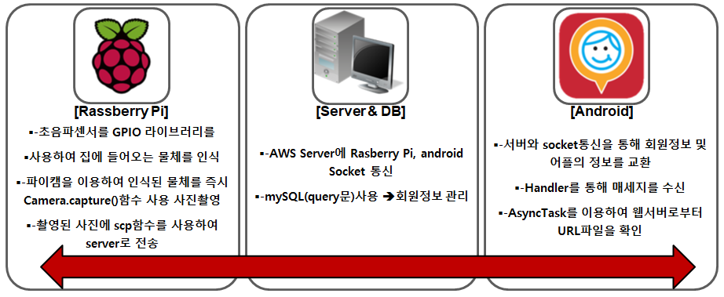
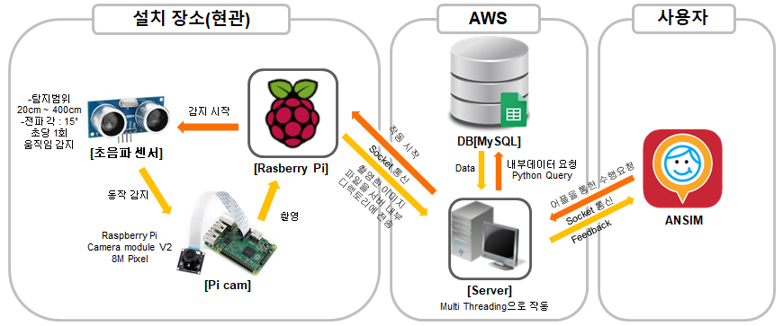

# 인터넷응용 파이널프로젝트(안심귀가서비스)

## 문 근처에 오는 사람의 사진을 핸드폰으로 자동 전송 및 알림

* 라즈베리파이와 안드로이드의 소켓통신을 이용하여 귀가를 보다 안전하고 보호자가 확 실히 확인할 수 있는 알린 시스템을 사용한다. 보호자는 어플 사용자로 보호가 필요로 하는 사람 이 귀가할 경우 사진을 통해 알림을 받고 확인할 수 있다.

## 기술 및 구성도

* 기술설명

  

* 구성도

  

## 시나리오

